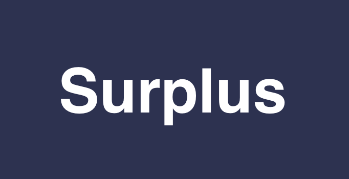

# Surplus

  

  <strong>A Sustainable Marketplace & Food Donation Platform</strong>

  <a href="#features">Features</a> •
  <a href="#getting-started">Getting Started</a> •
  <a href="#installation">Installation</a> •
  <a href="#tech-stack">Tech Stack</a> •
  <a href="#contributing">Contributing</a> •
  <a href="#license">License</a>

## About

Surplus is a dual-purpose platform that combines a sustainable marketplace for pre-owned items with a food donation service. Our mission is to reduce waste and support communities by connecting users who want to buy/sell used items and enabling restaurants to donate excess food to those in need.

## Features

### 🛍️ Marketplace
- Browse and list pre-owned items
- Advanced search and filtering
- Secure in-app messaging
- User ratings and reviews

### 🍱 Food Donation
- Real-time food availability updates
- Location-based donation listings
- Restaurant verification system
- Food safety compliance tracking

### 📱 Core Features
- User authentication and profiles
- Geolocation services
- Push notifications
- Responsive web and mobile design

## Getting Started

### Prerequisites

- Node.js (v16 or higher)
- MongoDB
- React Native development environment (for mobile)
- Firebase account
- Auth0 client ID, domain
- Google Maps API key

### Installation

1. Clone the repository
2. Install dependencies
   - Install server dependencies: `npm install`
   - Install client dependencies: `cd client && npm install`
   - Install mobile dependencies: `cd mobile && npm install`
3. Set up environment variables
4. Configure your environment variables with your:
   - MongoDB URI
   - Firebase credentials
   - Google Maps API key
   - Other server-specific variables
5. Start the backend server
- `cd server`
- `npm run dev`

6. Start the development server
   - `cd server`
   - Start the server: `npm run dev`
   - Start the web client: `cd client && npm run dev`
   - Start the mobile app: `cd mobile && npx react-native run-android` or `npx react-native run-ios`

## Tech Stack

### Backend
- Node.js & Express
- MongoDB
- Firebase Authentication
- WebSocket for real-time features
- Redis for caching

### Web Frontend
- Vite + React Native
- Redux Toolkit
- React Query
- Styled Components
- Material-UI

### Mobile App
- Vite + React Native
- React Navigation
- Native Base
- Redux Toolkit
- React Query

### Infrastructure
- Firebase for authentication and database
- AWS/GCP for hosting
- CloudFront/Firebase for CDN
- GitHub Actions for CI/CD
- Docker for containerization

## Contributing

We welcome contributions to Surplus! Please follow these steps:

1. Fork the repository
2. Create a new branch (`git checkout -b feature/amazing-feature`)
3. Make your changes
4. Commit your changes (`git commit -m 'Add some amazing feature'`)
5. Push to the branch (`git push origin feature/amazing-feature`)
6. Open a Pull Request

## License

This project is licensed under the MIT License - see the [LICENSE](LICENSE) file for details.

## Acknowledgments

- Thanks to all our contributors
- Special thanks to our partner organizations
- Icons provided by [FontAwesome](https://fontawesome.com)
- UI components inspired by [Material Design](https://material.io)

## Contact

- Project Link: [https://github.com/saad-mh/surplus](https://github.com/saad-mh/surplus)
- Website: [Surplus](https://surplus-psi.vercel.app/)
- Email: g0ne@googlegroups.com

## Project Status

Current Version: 0.0.1-beta

## Support

If you need help or have questions:
1. Join our [Discord Community](https://discord.gg/TCFAJkmV5Q)
2. Email our support team at (g0ne@googlegroups.com)

## Roadmap

See our [Roadmap](roadmap.md) for planned features and improvements.

## Security

Found a security vulnerability? Please email g0ne+security@googlegroups.com instead of opening a public issue.